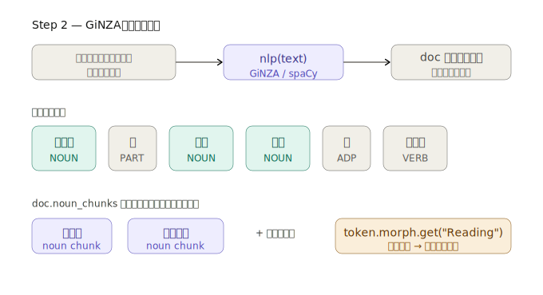
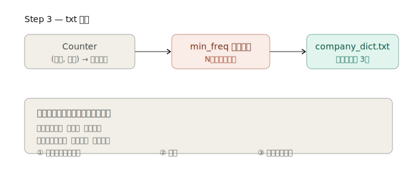

## 目標
最終目標は
CSVファイルから社内用語（高PMIの連続名詞）を抽出し、PCのIME（Google日本語入力やMS-IME）にインポートできる形式の辞書ファイルを出力する
全体的な流れ:


- Step 1（抽出） PDFはpdfminerがバイナリを読んで生テキストを返す。CSVはpandasで特定カラムを文字列結合。ただしSudachiPyが49,149バイト制限を持つので、40,000バイトずつチャンクに切ってから次のステップに渡す。
  
- Step 2（解析） GiNZAのモデルがチャンクを受け取り、形態素解析で各単語の品詞を判定する。doc.noun_chunks を使うと「名詞が連続しているまとまり」だけを取り出せる（「使用」+「方法」→「使用方法」のように）。さらに各トークンの morph.get("Reading") でカタカナ読みを取得し、ひらがなに変換する。
  
- Step 3（出力） Counterで (単語, よみ) のペアごとに出現回数を数え、min_freq未満は捨てて、よみ[TAB]単語[TAB]固有名詞 の3列で書き出す。このフォーマットがGoogle日本語入力のインポート形式に直接対応している。
  
```shell
pip install -U spacy ginza ja-ginza pandas
pip install pdfminer.six
```


### 注意事項
GiNZAのバージョンによって読み取得の方法が異なります。現在のGiNZAでは token.morph.get("Reading") を使います。
修正箇所 
#### 修正前
```python
yomi = "".join([token._.reading for token in nc])

```

#### 修正後
```python
yomi = "".join([
token.morph.get("Reading")[0] if token.morph.get("Reading") else token.text
for token in nc
])
```

token.morph.get("Reading") はリストを返すので [0] で取得し、読みがない場合は token.text をそのまま使うようにしています。

# 課題
てにおは を取り除けていない単語が割とある。      


